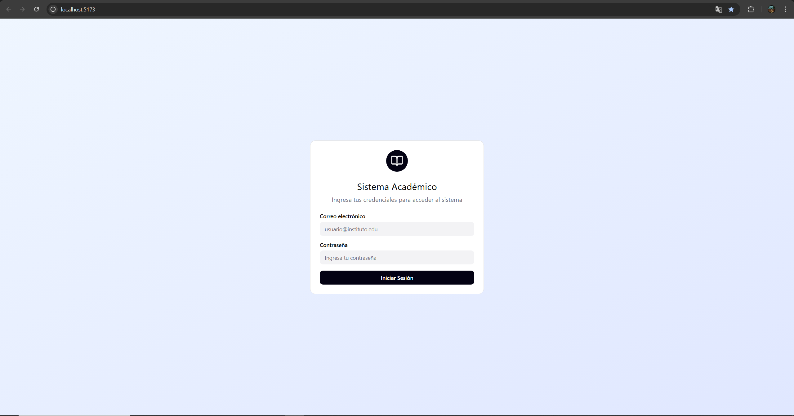
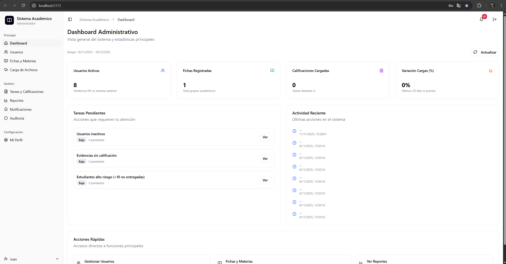
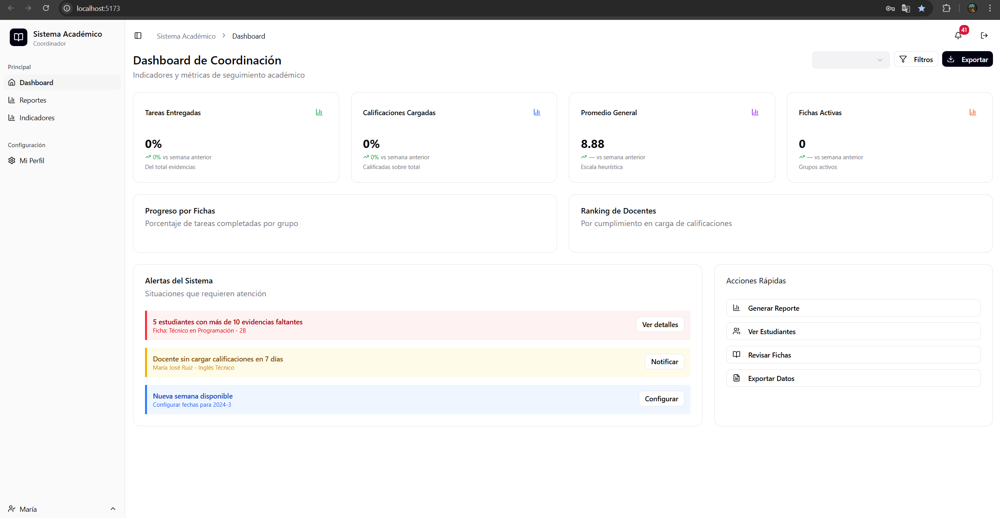
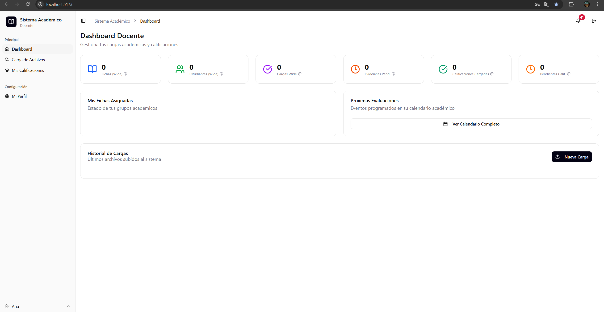
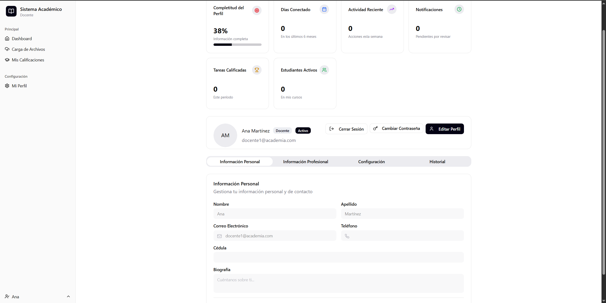
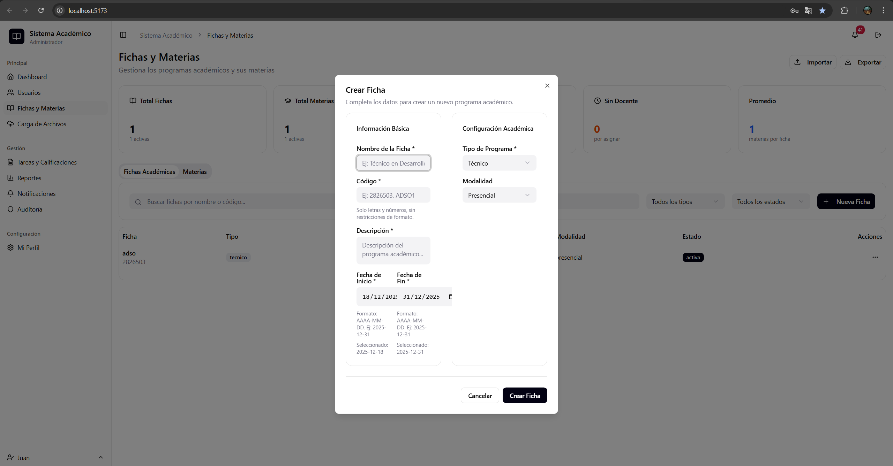
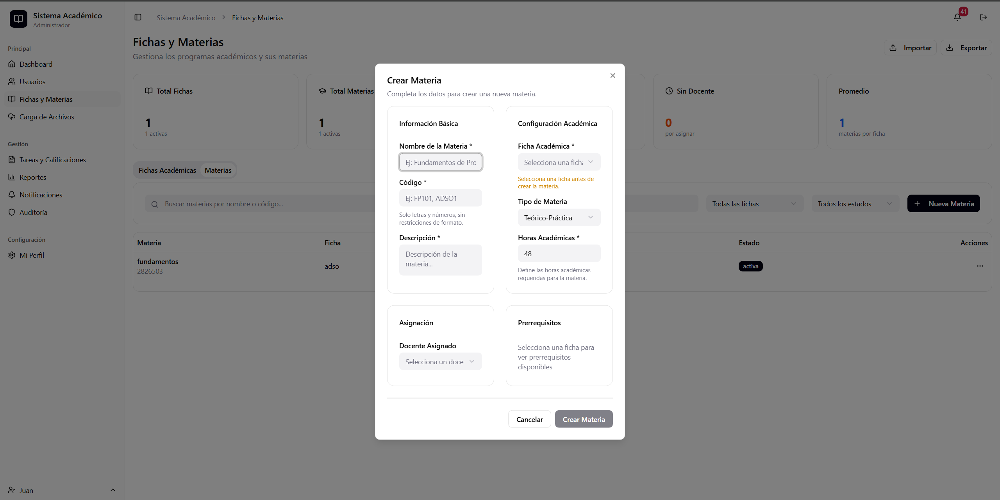
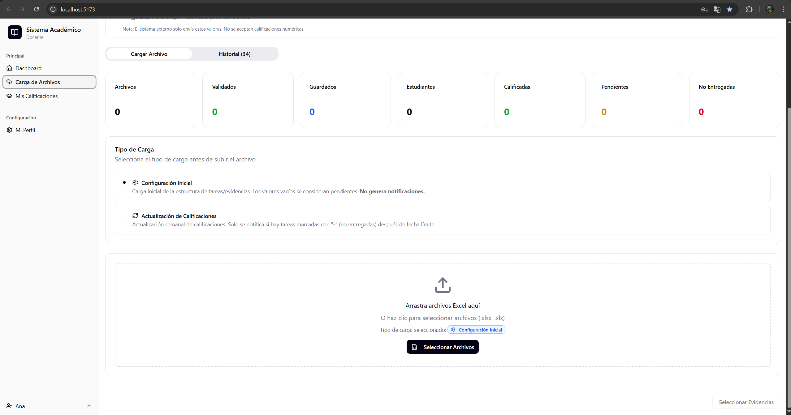
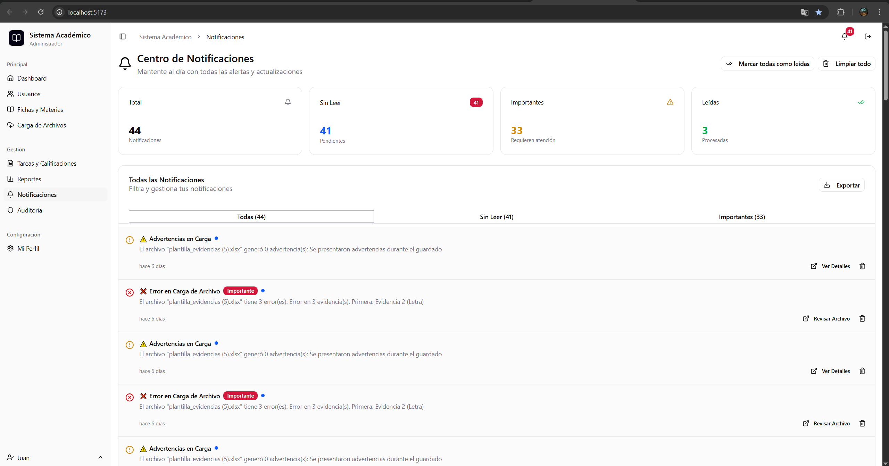
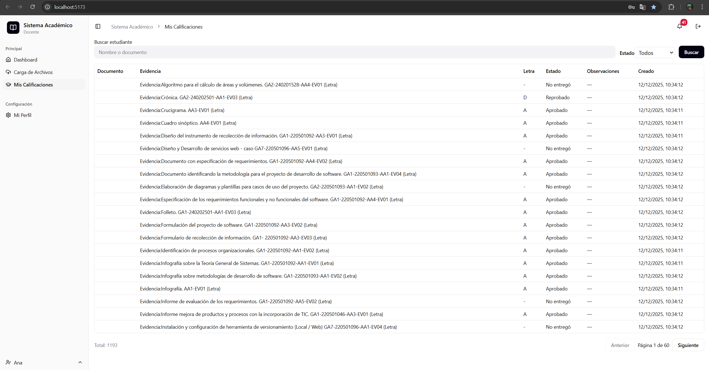

# Sistema de Gestión Académica (SIGA) – SENA

Autor: Jonny Ricardo Guzmán Ramírez  
Rol: Desarrollador del sistema  
Institución: Servicio Nacional de Aprendizaje (SENA)

Nota aclaratoria: Este manual documenta el estado actual del sistema SIGA al momento de su elaboración. Las funcionalidades descritas pueden cambiar conforme evolucione el proyecto y se incorporen nuevos módulos o mejoras.

## Introducción
SIGA es una aplicación web orientada a la gestión académica interna del SENA. En su estado actual, el sistema se centra principalmente en la carga, validación y administración de información académica mediante archivos Excel, así como en la gestión de entidades académicas clave como usuarios, fichas y materias. Los estudiantes no tienen acceso directo al sistema; su interacción se limita a la recepción de notificaciones por correo electrónico cuando el sistema lo determine. Los roles activos dentro del sistema son: Docente, Coordinador y Administrador, cada uno con permisos y vistas diferenciadas.

Backend: FastAPI. Frontend: React.

## Requisitos para acceder al sistema
- Credenciales de acceso asignadas por el Administrador (correo institucional y contraseña).
- Conectividad a la red donde se encuentre desplegado el sistema.
- Navegador web moderno (Google Chrome, Microsoft Edge o Mozilla Firefox).
- El sistema debe encontrarse previamente desplegado y en ejecución por el responsable técnico (backend y frontend activos). En entornos de desarrollo, iniciar el backend con el script `RUN_FASTAPI.bat` y el frontend con Vite/React.

## Flujo general de uso
- Inicio de sesión: El usuario accede al portal e ingresa sus credenciales en la pantalla de autenticación.
- Dashboard: Tras la autenticación, el sistema muestra un tablero principal adaptado al rol del usuario (Administrador, Coordinador o Docente).
- Cierre de sesión: El usuario puede cerrar sesión desde la interfaz principal al finalizar su trabajo.

## Uso por rol
A continuación se documentan únicamente funcionalidades verificadas en el proyecto.

### Docente
Funciones disponibles:
- Acceso al dashboard correspondiente al rol Docente.
- Carga de archivos Excel para la configuración inicial y actualización de calificaciones mediante el módulo de Carga de Archivos.

Carga de archivos Excel:
- Seleccionar el archivo Excel proveniente del sistema externo de calificaciones.
- Elegir el tipo de carga (configuración inicial o actualización).
- Mapear las columnas requeridas (documento, nombre, apellido, correo, evidencias).
- Nota: La estructura y las columnas pueden variar según la versión de la plantilla configurada en el sistema.
- Previsualizar los datos cargados y revisar advertencias o errores detectados.
- Guardar las evidencias seleccionadas cuando aplique.

Consulta:
- Visualización previa de los datos cargados dentro del módulo de Carga de Archivos.

### Coordinador
Funciones disponibles:
- Acceso al dashboard del Coordinador.
- Visualización de métricas generales y actividad reciente relacionadas con las cargas de información y el estado de las evidencias.

Nota:
El rol de Coordinador es actualmente de carácter consultivo. No cuenta con funcionalidades de edición, aprobación o intervención directa sobre los datos desde la interfaz actual.

### Administrador
Funciones disponibles reales:
- Gestión de usuarios: listados, filtros y formularios de creación y edición, con carga inicial desde el backend y mecanismo de respaldo visual (fallback local) en caso de indisponibilidad.
- Gestión de fichas y materias: listados, creación, edición y eliminación (CRUD), filtros y visualización de detalles.
- Carga de archivos Excel (funcionalidad compartida con el rol Docente).
- Acceso al dashboard del Administrador con estadísticas generales, actividad reciente y tareas pendientes.

Módulos activos:
- Usuarios: Tabla de usuarios, búsqueda y formulario de creación/edición.
- Fichas y Materias: Pestañas separadas con tablas, detalles de ficha y formularios.
- Carga de Archivos: Flujo de mapeo, validación y guardado de información.
- Dashboards por rol: Acceso y visualización según permisos asignados.

## Manejo de errores reales
- Si el backend no responde, los módulos de Usuarios y Fichas/Materias muestran un mensaje informativo y utilizan datos locales para mantener la operación visual.
- En el módulo de Carga de Archivos, los errores de validación del archivo Excel se muestran durante la previsualización, indicando fila, campo y tipo de error. Se recomienda corregir el archivo de origen antes de confirmar el guardado.
- La pantalla de inicio de sesión notifica cuando las credenciales son inválidas.
- En caso de problemas con estilos o carga visual de la interfaz, se recomienda revisar la correcta importación de los estilos globales según la guía de solución de problemas.
- El comportamiento ante errores puede variar según el entorno de ejecución (desarrollo, pruebas o producción).

## Buenas prácticas de uso
- Utilizar exclusivamente archivos Excel generados por el sistema externo autorizado.
- Verificar cuidadosamente el mapeo de columnas antes de guardar la información.
- Revisar advertencias durante la carga de evidencias.
- Mantener la sesión activa solo durante el tiempo necesario y cerrarla al finalizar el trabajo.

## Funcionalidades pendientes o en desarrollo
- Actualización del perfil de usuario y cambio de contraseña mediante endpoints definitivos: en desarrollo.
- Reportes avanzados y dashboards de análisis estadístico: pendientes.
- Integraciones adicionales para notificaciones automatizadas: sujetas a la configuración futura del backend.

## Glosario
- Ficha: Grupo académico asociado a un programa de formación.
- Materia: Asignatura perteneciente a una ficha, con atributos como horas, tipo y estado.
- Evidencia: Actividad evaluativa del estudiante, entregada o pendiente.
- Dashboard: Vista de resumen con métricas e información relevante del sistema.

## Conclusiones
El sistema SIGA permite, en su estado actual, la autenticación por roles, la gestión de usuarios, fichas y materias, así como la carga y validación controlada de archivos Excel. Este manual refleja de forma fiel y honesta las funcionalidades implementadas y verificadas hasta el momento. Todo el contenido aquí descrito está sujeto a cambios conforme avance el desarrollo del proyecto.

---

## Navegación rápida en la interfaz
- Inicio de sesión: Pantalla "Login" al acceder al portal.
- Dashboard: "Dashboard" según rol (Administrador, Coordinador o Docente).
- Usuarios: Menú "Administración" → "Usuarios".
- Fichas y Materias: Menú "Academia" → "Fichas y Materias" (pestañas separadas).
- Carga de Archivos: Menú "Academia" → "Carga de Archivos".

Nota: Los nombres de menú pueden variar ligeramente según la versión de la interfaz. Este esquema corresponde al estado actual del proyecto.

## Pasos de arranque (Windows)
Estos pasos están orientados al entorno de desarrollo y pueden variar en despliegues productivos.

1) Backend FastAPI

```bash
.venv\Scripts\activate
".venv\Scripts\python.exe" -m uvicorn backend_fastapi.app.main:app --host 127.0.0.1 --port 8000 --reload
```

2) Frontend Vite (React)

```bash
npm install
npm run dev
```

3) Acceso
- Abrir: http://localhost:5173/
- Verificar login y acceso a dashboards por rol.

Advertencia: Si el puerto/backend cambian, la configuración de APIs del frontend debe actualizarse para apuntar al servicio correcto.

---

## Guía visual por pantallas (con capturas)
Nota: Inserta las imágenes en la carpeta `docs/img/`. Los nombres sugeridos aparecen en cada sección. Si usas otros nombres, actualiza la ruta del enlace en este documento. El contenido descrito corresponde estrictamente a lo visible en la interfaz actual.

### 1) Pantalla de inicio de sesión (Login)

- Campos: correo institucional y contraseña.
- Acción: botón “Iniciar Sesión”.
- Mensajes visibles: “Credenciales inválidas. Intenta nuevamente.” cuando el login falla.

### 2) Dashboard por rol
#### 2.1 Administrador

- Tarjetas de estadísticas principales (usuarios activos, fichas registradas, calificaciones cargadas, variaciones) cuando hay datos.
- Actividad reciente: lista de eventos con íconos de estado.
- Tareas pendientes: agrupadas por prioridad (Alta/Media/Baja).
- Acción: botón “Actualizar” para recargar datos.

#### 2.2 Coordinador

- Visualización de métricas y actividad reciente. Rol de carácter consultivo (sin edición de datos desde la UI).

#### 2.3 Docente

- Vista informativa acorde al rol (métricas y accesos relevantes al docente).

#### 2.4 Perfil de Usuario

- Vista de perfil con datos básicos del usuario y actividad relacionada (según implementación visible).

### 3) Gestión de Usuarios

- Tabla con búsqueda y filtros.
- Formulario de creación/edición de usuarios.
- Comportamiento ante error backend: mensaje informativo y datos locales de respaldo para visualización.

### 4) Fichas y Materias


- Pestañas: “Fichas” y “Materias”.
- Acciones CRUD (crear, editar, eliminar) según permisos.
- Detalle de ficha y formularios asociados.

### 5) Carga de Archivos (Excel)

- Selección de archivo Excel proveniente del sistema externo.
- Tipo de carga: configuración inicial o actualización.
- Mapeo de columnas: documento, nombre, apellido, correo, evidencias (pueden variar según plantilla).
- Previsualización con validaciones: errores/advertencias por fila/campo.
- Resumen por evidencia: totales, A, D, pendientes y no entregadas.
- Guardado de evidencias seleccionadas (cuando aplique) y notificaciones de resultado.

### 6) Centro de Notificaciones

- Campana de notificaciones y listado de avisos dentro del centro de notificaciones.

### 7) Auditoría


- Tabla de registro de eventos visibles en la UI (acciones, fecha/hora y detalles relevantes).

### 8) Calificaciones

- Vista de calificaciones conforme a la interfaz actual (si está habilitada), mostrando listados y estados asociados.

---

## Cómo aportar capturas (recomendado)
1) Toma la captura en Windows (Win + Shift + S) y guarda como PNG.
2) Copia los archivos a la carpeta `docs/img/` con los nombres sugeridos, por ejemplo:
	- `login.png`, `dashboard_admin.png`, `dashboard_coordinador.png`, `dashboard_docente.png`,
	- `usuarios.png`, `fichas_materias.png`, `carga_archivos.png`, `notificaciones.png`, `auditoria.png`.
3) Verifica que cada imagen se visualice correctamente en este manual.
